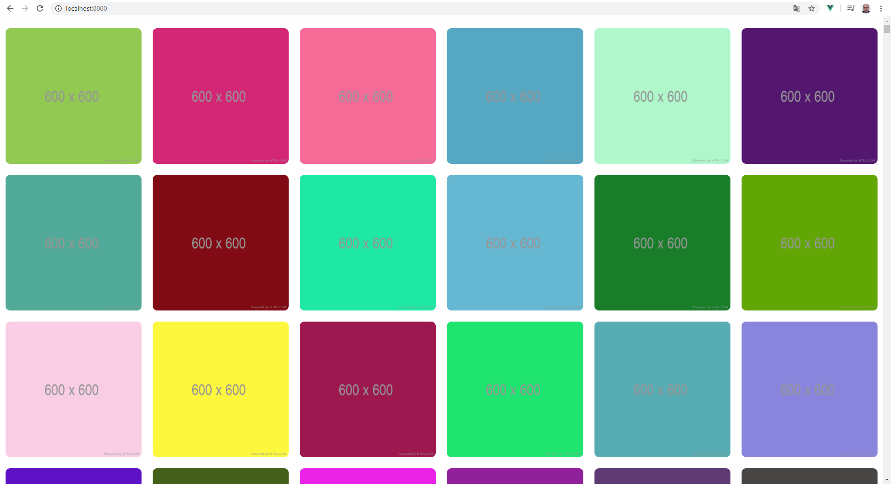
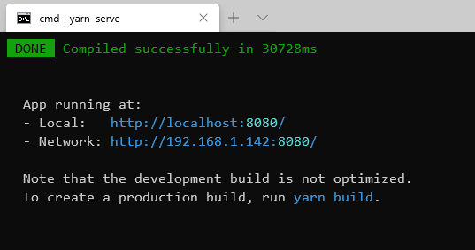

# Photo grid

## Description

This app loads an images list from this url:

[https://jsonplaceholder.typicode.com/photos](https://jsonplaceholder.typicode.com/photos)

And it place them in the screen according the resolution of the device.



## Execute the app

After cloning the project it must to install the dependencies. To do this it must launch this command:

```
yarn install
```

When the dependencies are installed, you can launch a local server to run the app with this command:

```
yarn serve
```

When server is available, the console shows this message:



In a browser, enter the url indicated by the server according to if you want to access from the local machine or from a network machine

## Testing the app

The app has two tests batch: Unit and E2E tests.

You can run the unit tests with this command:

```
yarn test:unit
```

And the E2E tests with this command:

```
yarn test:e2e
```

## Demo

You can see a demo of the app here:

[https://theguitxo.github.io/photogrid-vue/](https://theguitxo.github.io/photogrid-vue/)
